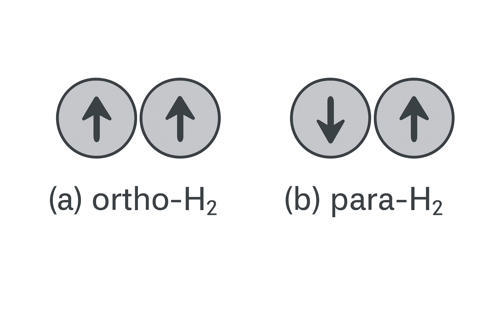

# 玻尔兹曼统计之应用：理想气体的内能和热容

本节以双原子分子理想气体为例讲理想气体内能和热容的量子统计理论。

暂不考虑原子内电子的运动。双原子分子的能量可表示为平动能、振动能和转动能之和:
```{math}
\epsilon = \epsilon^\text{t} + \epsilon^{v} + \epsilon^\text{r}.
```
以{math}`\omega^t`、{math}`\omega^v`、{math}`\omega^r`分别表示平动、振动、转动能级的简并度, 则配分函数{math}`Z_1`可表示为：
```{math}
Z_1 = \sum_l \omega_l e^{-\beta\epsilon_l}.
```
因这三部分（平动、振动和转动）的自由度相互独立，每一个振动、转动、平动组合都可以构成一个不同的量子态。故，总配分函数可以写成平动配分函数、振动配分函数与转动配分函数之积：
```{math}
Z_1 = \sum_{\text t v r} \omega^t \omega^v \omega^r e^{-\beta(\epsilon^\text{t} + \epsilon^\text{v} + \epsilon^\text{r} )}
= Z_1^\text{t} + Z_1^\text{v} + Z_1^\text{r}.
```

利用理想气体内能与总配分函数之关系，可导出：内能可表示为平动能、转动能与振动能之和:
```{math}
U = -N \frac{\partial}{\partial \beta}\ln Z_1  = U^\text{t} +  U^\text{v} + U^\text{r}. 
```
相应地，热容也就可以表示为平动热容、转动热容与振动热容之和:
```{math}
C_V = C_V^\text{t} +  C_V^\text{v} + C_V^\text{r}. 
```

分别计算平动、振动和转动对内能的贡献可得如下结果。
1. 平动能和平动热容的表达式与由经典统计的能量均分定理得到的结果一致。
平动自由能为
```{math}
Z_1^t = V(\frac{2\pi m}{h^2 \beta})^{3/2}
```
可导出
```{math}
U^t = -N\frac{\partial}{\partial \beta}\ln Z_1^t = \frac{3}{2}NkT; C_V^t = \frac{3}{2}Nk. 
```
双原子分子中的两原子的相对振动，可以近似地看成线性谐振子。振子的能级为
```{math}
\epsilon_n = (n + 1/2) \hbar \omega, n = 0,1,2,\cdots
```
振动配分函数为
```{math}
Z_1^v = \sum_{n=0}^{\infty} e^{-\beta\hbar\omega (n+1/2)},
```
可导出
```{math}
Z_1^v = \frac{e^{-\frac{\beta\hbar\omega}{1}}}{1-e^{-\beta\hbar\omega}}.
```
因此，振动对内能的贡献为
```{math}
U^v = -N\frac{\partial}{\partial\beta}\ln Z_1^v = \frac{N\hbar\omega}{2} + \frac{N\hbar\omega}{e^{\beta\hbar\omega}-1}.
```
上式中第一项为零点能，第二项为温度为{math}`T`时振子的热激发能.

2. 由于双原子分子的振动特征温度是1000K这个量级，因此在常温范围，振动自由度对热容的贡献接近于0。其物理意义是：振子取得热运动能量而跃迁到激发态的概率很小。也就是说，几乎全部振子都冻结在基态。
3. 讨论双原子分子的转动时，需要区分这两个原子是同核还是异核这两种情况：同核双原子分子(如氢气、氧气等)和异核双原子分子（如NO,CO等）。双原子分子的转动能级可用转动量子数{math}`l`表示出，转动能级的简并度{math}`2l+1`。
知道了转动能级和简并度，就可以写出转动配分函数的表达式。在此，引入与分子转动惯量相关的一个特征温度--转动特征温度。此时，会发现在常温{math}`T`下，这个转动温度远远小于{math}`T`. 
于是，当转动量子数改变时，转动能级就可以近似看成是做连续变化的变量。这样，我们计算转动配分函数时，就可以用积分去代替其中的求和，并可以得到转动能等于{math}`NkT`, 转动热容为Nk. 这正是经典统计能量均分定理的结果。 
这里的物理意义是：常温范围内，转动能级间距远远小于{math}`kT`,因此转动能与{math}`kT`之比值就可以看成是连续变量，量子统计与经典统计得到的转动热容相同。
对于同核的双原子分子，我们需要考虑微观粒子全同性对分子转动状态的影响。分子的转动状态与两个原子核的自旋状态有关。我们以氢气为例。若两个氢核的自旋平行，则氢分子的转动量子数{math}`l`只能取奇数；若两个氢核的自旋反平行，则氢分子的转动量子数{math}`l`只能取偶数。前者，称为正氢(Ortho-H{math}`_2`)，后者称为仲氢(Para-H{math}`_2`), 如图1所示。这两类氢气基本不会发生相互转化。二者的比例分别约为3/4和1/4。
这样，氢气的转动内能可以写为正氢和仲氢的转动内能项之和，系数分别为3/4和1/4。氢分子转动惯量小，因此其转动特征温度(85.4 K)较其他气体的要高。在温度远高于此特征温度的高温，氢分子处于转动量子数{math}`l`较大的转动状态。
这样，正氢的转动配分函数和仲氢的转动配分函数几乎相等，我们仍然可以得到转动热容为Nk。这与能量均分定理的结果一致。低温下，能量均分定理不再适用。



电子对气体热容是否有明显贡献依赖于原子基态能级的自旋角动量与轨道角动量是否存在耦合。对单原子分子，在原子基态能级的自旋角动量或轨道角动量这二者之一为0时，原子的基态能级不存在精细结构。原子内电子的激发态与基态能量之差大体是eV这个量级。相应的特征温度为1千到1万K。
因此，在一般温度下，热运动难以使电子跃迁到激发态，因此，电子被冻结到基态，故对热容没有贡献。反之，如果原子基态能级的自旋角动量与轨道角动量都不为0，则它们的耦合作用将导致基态能级的分裂，产生精细结构。例如氧原子的基态能级存在特征温度为230 K和320 K的能级分裂。在与此特征温度可比拟的温度下，电子运动对热容就有贡献。 双原子分子也有类似的情形。

## Reference 
https://coderefinery.github.io/documentation/sphinx/ 
